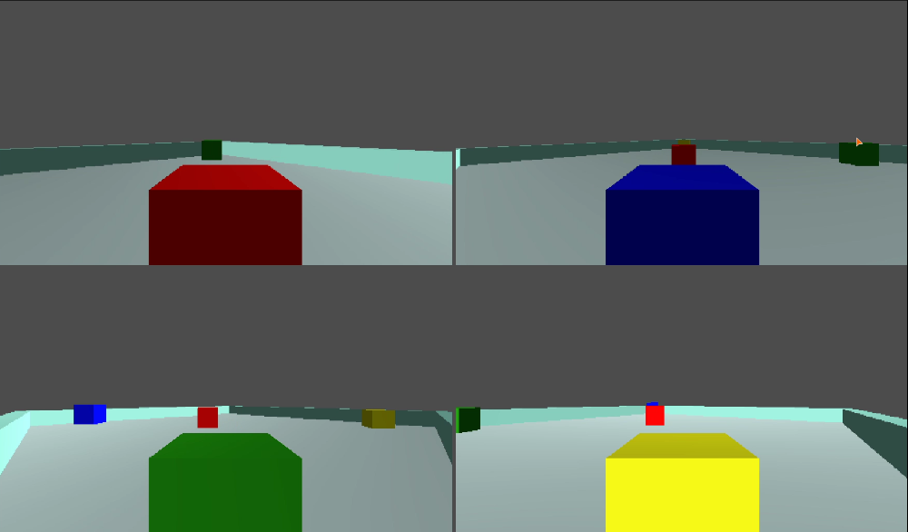

4-Player Splitscreen Demo for the Godot engine
===

This is a small project that has the layout of a local splitscreen game akin to one found on the Nintendo 64. Please note that this is _not_ a fully functional demo; it's not even close. It's mainly to demonstrate how a 4-player splitscreen game could be laid out in the Godot engine. Meant for version 3.1 of the engine, though could run in newer versions of the engine.

